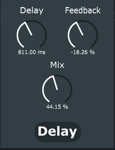

Delay
=====

A delay effect plugin made with JUCE (v.5.4.3). User controlled parameters include:
- Delay: Delay time from 0 to 2 seconds.
- Feedback: Feedback gain from -99 to 99 % (-0.99 to 0.99).
- Mix: Mix between the direct input path and delay path from 0 % (only input) to 100 % (only delay).

		
	

